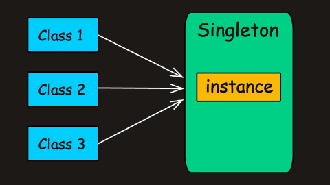

# Why Should You Use Design Patterns?

#### 🔁 Reusability

> **“Don’t just solve the problem. Solve it** _**well**_**, and solve it** _**once**_**.”**

#### 🔧 **Maintainability**

> **“Clean design today prevents chaos tomorrow.”**

#### 📖 Readability

> **“Good code is read more often than it is written.”**

#### ⚙️ Flexibility

> **“Design for change. Because change** _**will**_ **come.”**

# Categories of Design Patterns

### 1. **Creational Patterns** – How objects are created

They abstract the instantiation process and help make your system independent of how its objects are created.

- **Singleton** – Ensure a class has only one instance.
- **Factory Method** – Delegate object creation to subclasses.
- **Abstract Factory** – Create families of related objects.
- **Builder** – Construct complex objects step-by-step.
- **Prototype** – Clone existing objects instead of creating new ones.

### 2. **Structural Patterns** – How objects are composed

They help organize different classes and objects to form larger structures.

- **Adapter** – Makes one interface compatible with another.
- **Decorator** – Adds new responsibilities to an object at runtime.
- **Facade** – Provides a simplified interface to a complex system.
- **Composite** – Treats individual and grouped objects uniformly.
- **Proxy** – Acts as a placeholder or access control for another object.

### 3. **Behavioral Patterns** – How objects interact

They define how communication happens between objects.

- **Strategy** – Enables selecting an algorithm at runtime.
- **Observer** – Notifies dependent objects of state changes.
- **Command** – Encapsulates a request as an object.
- **State** – Allows an object to change behavior based on internal state.
- **Template Method** – Defines the skeleton of an algorithm in a base class.


## Singleton Pattern

In software development, we often require classes that can only have **one object**.

> **Example:** thread pools, caches, loggers etc.

Creating more than one objects of these could lead to issues such as incorrect program behavior, overuse of resources, or inconsistent results.

This is where **Singleton Design Pattern** comes into play.



# What is Singleton Pattern?

> Singleton Pattern is a creational design pattern that guarantees a class has only one instance and provides a global point of access to it.


They have mainly 7 ways with some pros and cons 
 - [1. Lazy Initialization](https://algomaster.io/learn/lld/singleton#1-lazy-initialization)
- [2. Thread-Safe Singleton](https://algomaster.io/learn/lld/singleton#2-thread-safe-singleton)
- [3. Double-Checked Locking](https://algomaster.io/learn/lld/singleton#3-double-checked-locking)
- [4. Eager Initialization](https://algomaster.io/learn/lld/singleton#4-eager-initialization)
- [5. Bill Pugh Singleton](https://algomaster.io/learn/lld/singleton#5-bill-pugh-singleton)
- [6. Static Block Initialization](https://algomaster.io/learn/lld/singleton#6-static-block-initialization)
- [7. Enum Singleton](https://algomaster.io/learn/lld/singleton#7-enum-singleton)


### 1.Lazy Initialization 

Java:
```java
class LazySingleton {
    // The single instance, initially null
    private static LazySingleton instance;

    // Private constructor to prevent instantiation
    private LazySingleton() {}

    // Public method to get the instance
    public static LazySingleton getInstance() {
        if (instance == null) {
            instance = new LazySingleton();
        }
        return instance;
    }
}
```

C++ :
```cpp
class LazySingleton {
private:
    static LazySingleton* instance;

    LazySingleton() {}

public:
    static LazySingleton* getInstance() {
        if (instance == nullptr) {
            instance = new LazySingleton();
        }
        return instance;
    }
};
```

> Warning : This implementation is not thread-safe. If multiple threads call `getInstance()` simultaneously when `instance` is null, it's possible to create multiple instances.

 
 
### 2.Thread  Safe Singleton

Java:
```java
class ThreadSafeSingleton {
    private static ThreadSafeSingleton instance;

    private ThreadSafeSingleton() {}


    public static synchronized ThreadSafeSingleton getInstance() {
        if (instance == null) {
            instance = new ThreadSafeSingleton();
        }

        return instance;
    }
}
```
 
 C++ :
```cpp
class ThreadSafeSingleton {
private:
    static ThreadSafeSingleton* instance;
    static mutex lock;

    ThreadSafeSingleton() {}

public:
    static ThreadSafeSingleton* getInstance() {
        lock_guard<mutex> guard(lock);
        if (instance == nullptr) {
            instance = new ThreadSafeSingleton();
        }
        return instance;
    }
};
```

> The **synchronization** keyword ensures that only one thread can perform the (`instance == null)` check and create the object.

>> Warning : Although this approach is straightforward, using `synchronized` can cause substantial overhead and reduce performance, which can be a bottleneck if called frequently.

### Double Checking Locking

This approach minimizes performance overhead from synchronization by only synchronizing when the object is first created.

It uses the `volatile` keyword to ensure that changes to the instance variable are immediately visible to other threads.

Java:
```java

class DoubleCheckedSingleton {
    // The single instance, initially null, marked as volatile
    private static volatile DoubleCheckedSingleton instance;

    private DoubleCheckedSingleton() {}


    public static DoubleCheckedSingleton getInstance() {
        // First check (not synchronized)
        if (instance == null) {
            // Synchronize on the class object
            synchronized (DoubleCheckedSingleton.class) {
                // Second check (synchronized)
                if (instance == null) {
                    instance = new DoubleCheckedSingleton();
                }
            }
        }
        // Return the instance (either newly created or existing)
        return instance;
    }
}
```

C++:
```cpp
class DoubleCheckedSingleton {
private:
    static DoubleCheckedSingleton* instance;
    static mutex lock;

    DoubleCheckedSingleton() {}

public:
    static DoubleCheckedSingleton* getInstance() {
        if (instance == nullptr) {
            lock_guard<mutex> guard(lock);
            if (instance == nullptr) {
                instance = new DoubleCheckedSingleton();
            }
        }
        return instance;
    }
};
```

- If the first check (`instance == null)` passes, we synchronize on the class object.
- We check the same condition one more time because multiple threads may have passed the first check.
- The instance is created only if both checks pass.

Although this method is a bit complex to implement, it can drastically reduce the performance overhead.


### 4. Eager Initialization

In this method, we rely on the JVM to create the singleton instance when the class is loaded. The JVM guarantees that the instance will be created before any thread access the instance variable.

This implementation is one of the simplest and inherently thread-safe without needing explicit synchronization

Java:
```java
class EagerSingleton {
    // The single instance, created immediately
    private static final EagerSingleton instance = new EagerSingleton();

    private EagerSingleton() {}

    public static EagerSingleton getInstance() {
        return instance;
    }
}
```

C++ :
```cpp
class EagerSingleton {
private:
    static EagerSingleton* instance;

    EagerSingleton() {}

public:
    static EagerSingleton* getInstance() {
        return instance;
    }
};
```

- `static` variable ensures there's only one instance shared across all instances of the class.
- `final` prevents the instance from being reassigned after initialization.

This approach is suitable if your application always creates and uses the singleton instance, or the overhead of creating it is minimal.

>> Warning: While it is inherently thread-safe, it could potentially waste resources if the singleton instance is never used by the client application.

## 5. Bill Pugh Singleton

This implementation uses a static inner helper class to hold the singleton instance. The inner class is not loaded into memory until it's referenced for the first time in the `getInstance()` method.

It is thread-safe without requiring explicit synchronization.

```java
class BillPughSingleton {
    private BillPughSingleton() {}

    // Static inner class that holds the instance
    private static class SingletonHelper {
        private static final BillPughSingleton INSTANCE = new BillPughSingleton();
    }

    public static BillPughSingleton getInstance() {
        return SingletonHelper.INSTANCE;
    }
}

```

```cpp
class BillPughSingleton {
private:
    BillPughSingleton() {}

public:
    static BillPughSingleton* getInstance() {
        static BillPughSingleton instance;
        return &instance;
    }
};
```


- When the `getInstance()` method is called for the first time, it triggers the loading of the SingletonHelper class.
- When the inner class is loaded, it creates the INSTANCE of BillPughSingleton.
- The `final` keyword ensures that the INSTANCE cannot be reassigned.

The Bill Pugh Singleton implementation, while more complex than Eager Initialization provides a perfect balance of lazy initialization, thread safety, and performance, without the complexities of some other patterns like double-checked locking.


## 6. Static Block Initialization

This is similar to eager initialization, but the instance is created in a static block.

It provides the ability to handle exceptions during instance creation, which is not possible with simple eager initialization.

Java:
```java
class StaticBlockSingleton {
    private static StaticBlockSingleton instance;

    private StaticBlockSingleton() {}

    // Static block for initialization
    static {
        try {
            instance = new StaticBlockSingleton();
        } catch (Exception e) {
            throw new RuntimeException("Exception occurred in creating singleton instance");
        }
    }

    // Public method to get the instance
    public static StaticBlockSingleton getInstance() {
        return instance;
    }
}
```

C++:
```cpp
class StaticBlockSingleton {
private:
    static StaticBlockSingleton* instance;

    StaticBlockSingleton() {
        // Simulate possible exception
        // throw runtime_error("Failed to initialize");
    }

public:
    static StaticBlockSingleton* getInstance() {
        return instance;
    }

    static void init() {
        try {
            instance = new StaticBlockSingleton();
        } catch (...) {
            throw runtime_error("Exception occurred in creating singleton instance");
        }
    }
};
```

- The static block is executed when the class is loaded by the JVM.
- If an exception occurs, it's wrapped in a RuntimeException.

Warning

It is thread safe but not lazy-loaded, which might be a drawback if the initialization is resource-intensive or time-consuming.

## 7. Enum Singleton

In this method, the singleton is declared as an enum rather than a class.

Java ensures that only one instance of an enum value is created, even in a multithreaded environment.

The Enum Singleton pattern is the most robust and concise way to implement a singleton in Java.

Java:
```java
public enum EnumSingleton {
    INSTANCE;

    // Public method
    public void doSomething() {
        // Add any singleton logic here
    }
}
```

C++:
```cpp
class EnumSingleton {
private:
    EnumSingleton() {}

public:
    static EnumSingleton* getInstance() {
        static EnumSingleton instance;
        return &instance;
    }

    void doSomething() {
        cout << "Doing something..." << endl;
    }
};
```
Many Java experts, including [**Joshua Bloch**](https://en.wikipedia.org/wiki/Joshua_Bloch), recommend Enum Singleton as the best singleton implementation in Java.

>> Warning:It may not always be suitable especially if you need to extend a class or if lazy initialization is a strict requirement.