**Unified Modeling Language (UML)** is a standard way to visualize the design of a software system.

UML class diagram provides a static view of an object oriented system, showcasing its **classes, attributes, methods, and the relationships among objects.**

# 1. Building Blocks of Class Diagram

A UML class diagram consists of the following building blocks:

### 1. Class

A **class** is a blueprint or template that defines the properties and behavior of an object.

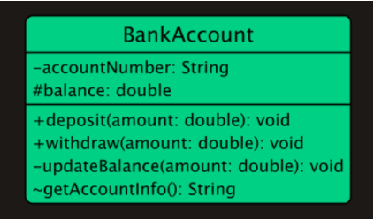

Represented as rectangles, classes are divided into three compartments:

- **Name (top compartment):** The unique identifier of the class (e.g., `BankAccount`).
- **Attributes (middle compartment):** The properties or data associated with the class (e.g., `accountNumber`, `balance`).
- **Operations (bottom compartment):** The actions or methods that can be performed by objects of the class (e.g., `deposit()`, `updateBalance()`).


**Visibility Markers**: Visibility markers indicate the accessibility of attributes and methods within a class.

- `+` **(Public):** The attribute or method is accessible from any class.
- `-` **(Private):** The attribute or method is only accessible within the same class.
- `#` **(Protected):** The attribute or method is accessible within the same class and its subclasses.
- `~` **(Package):** The attribute or method is accessible within the same package.

### **2. Attributes**

Attributes in a UML class diagram represent the properties or data fields of a class.

Attributes are typically written in the format:

```java
visibility name: type [multiplicity] = defaultValue
```

**Name**: The name of the attribute.

**Type**: The data type of the attribute.

**Multiplicity**: (Optional) Indicates how many instances of the type are allowed.

**Default Value**: (Optional) The initial value of the attribute.

**Example:**

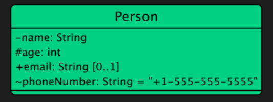
### **3. Methods**

Methods (or operations) in a UML class diagram represent the functions or behaviors that a class can perform.

Methods are typically written in the format:

```java
visibility name(parameterList): returnType
```

- **Name**: The name of the method.
- **Parameter List**: A comma-separated list of parameters, each specified as `name: type`.
- **Return Type**: The data type returned by the method.

**Example:**

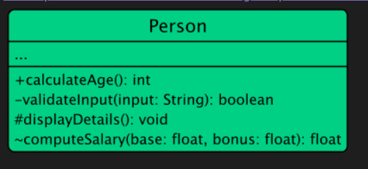

### 4. Interfaces

An interface defines a contract for classes that implement it. It specifies a set of methods that the implementing classes must provide.

Interfaces are depicted as a class rectangle with the keyword `«interface»` above the interface name. Methods in interfaces are abstract by nature, so they are usually shown without any implementation details.

**Example:**

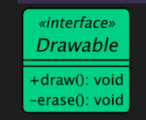
### 5. Abstract Class

An abstract class is a class that cannot be instantiated (you can't create objects directly from it).

It serves as a blueprint for other classes (subclasses) that inherit from it.

An abstract class in UML is represented with the class name in italics and the keyword `«abstract»` above the class name. Abstract methods within the class are also typically shown in italics.

**Example:**

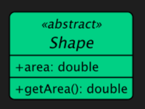

### 6. Enumeration

An enumeration is a data type that defines a set of named values (e.g., colors, days of the week).

Enumerations, or enums, are represented with the keyword `«enumeration»` above the enumeration name. The values of the enumeration are listed within the class box.

**Example:**

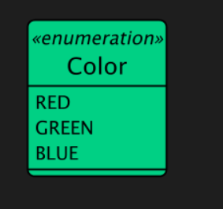

### 7. Multiplicity

Multiplicity specifies the number of instances of one class that can be related to a single instance of another class.

It is represented by a number or a range of numbers near the end of an association line.

Common multiplicities include: **1 (exactly one), 0..1 (zero or one), * (zero or more), 1..* (one or more).**

# 2. Relationships in Class Diagram

There are six main types of relationships between classes: association, aggregation, composition, inheritance, implementation and dependency.

The arrows for the six relationships are as follows:

#### 1. Association

Association represents a "uses-a" relationship between two classes where one class uses or interacts with the other.

**Example:** A `Car` has a `Driver`. `Car` class **uses**, or **references** `Driver` class.

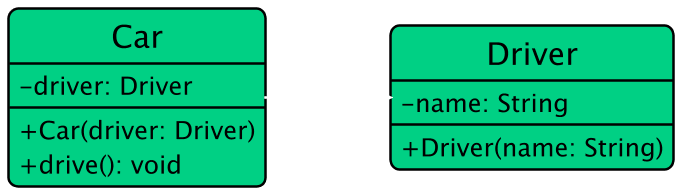
#### 2. Aggregation

Aggregation represents a "has-a" relationship where one class (the whole) contains another class (the part), but the contained class can exist independently.

**Example:** A `Car` class has an `Engine` class but the Engine class can exist without the Car class.
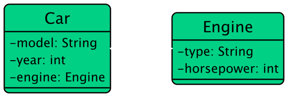

#### 3. Composition

Composition represents a **strong** "has-a" relationship where the part cannot exist without the whole. If the whole is destroyed, the parts are also destroyed.

**Example:** A `House` class is composed of `Room` class but the Room class can not exist without the House class.
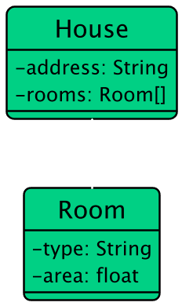
#### 4. Inheritance

Inheritance (or Generalization) represents an "is-a" relationship where one class (subclass) inherits the attributes and methods of another class (superclass).

**Example:** A `Dog` class and a `Cat` class inherit from an `Animal` class, as both dogs and cats are animals.
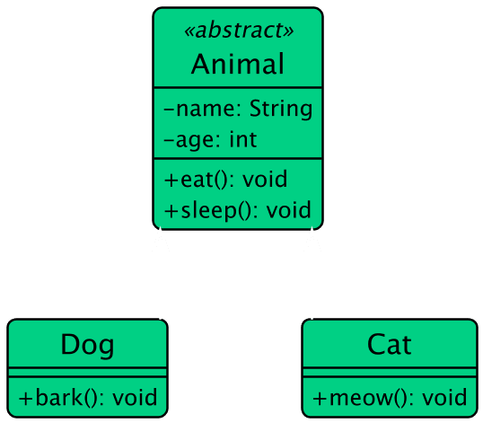
#### 5. Realization (Implementation)

Realization or implementation represents a relationship between a class and an interface, where the class implements the methods declared in the interface.

**Example:** A `Rectangle` class and a `Circle` class implement the `Shape` interface, which declares a `getArea()` method.
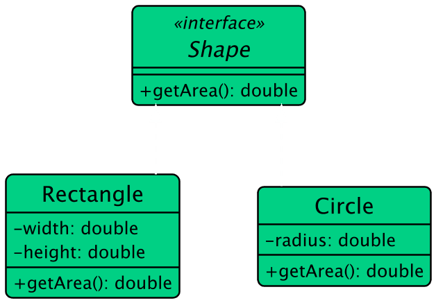

#### 6. Dependency

Dependency represents a "uses" relationship where a change in one class (the supplier) may affect the other class (the client).

**Example:** A `Customer` class uses an `Order` class to place order.

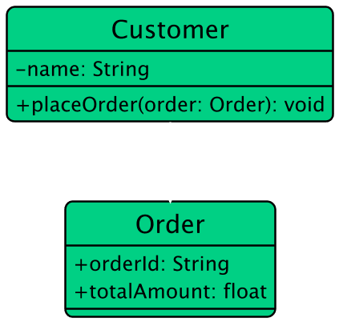

# 3. Combined Example

Here's a comprehensive example that includes various types of relationships:
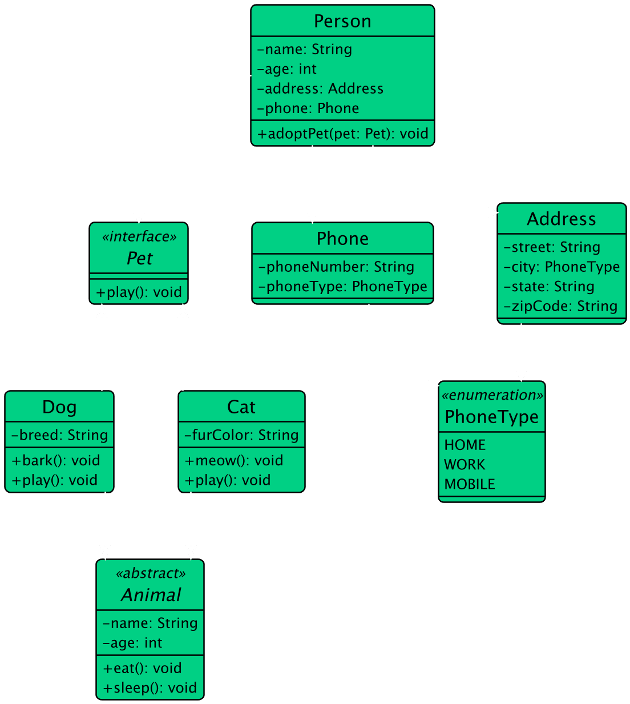

The relationships between the classes are as follows:

- **Inheritance:** `Dog` and `Cat` inherit from `Animal`.
- **Realization/Implementation:** `Dog` and `Cat` implement the `Pet` interface.
- **Aggregation:** `Person` has an aggregation relationship with `Pet`, indicating that a person can have multiple pets.
- **Composition:** `Person` has a composition relationship with `Address`, indicating that an address cannot exist without a person.
- **Association:** `Person` has an association relationship with `Phone`, indicating that a person can have multiple phone numbers.
- **Dependency:** `Phone` depends on the `PhoneType` enumeration for the `phoneType` attribute.

Among the six types of relationships, the code structure of composition, aggregation, and association is the same, and it can be understood from the strength of the relationship. The order from strong to weak is: **inheritance → implementation → composition → aggregation → association → dependency**